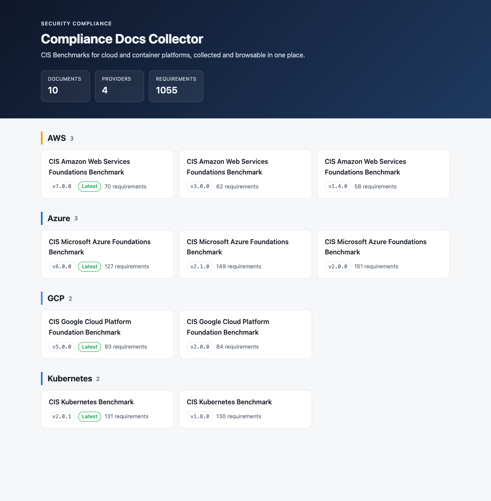
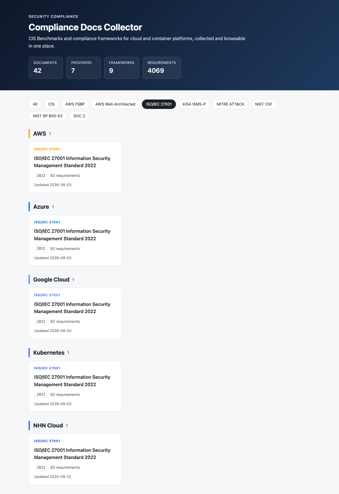
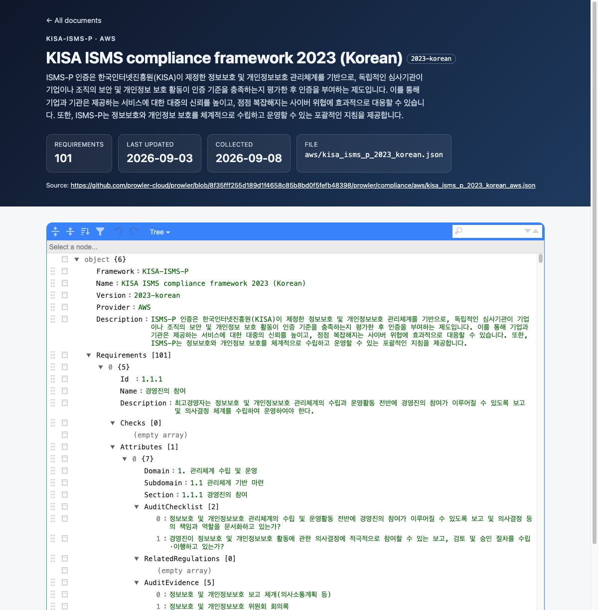

# Security Compliance Docs Collector

Collects security compliance documents — CIS Benchmarks and frameworks such as ISO/IEC 27001, KISA ISMS-P, NIST SP 800-53 and SOC 2 — for cloud and container platforms, tracks their upstream revisions, and serves them through a web viewer with framework filters.



### Environment

- Go 1.24+ (standard library only, no external dependencies)

### Installation

```sh
git clone https://github.com/gunh0/security-compliance-docs-collector.git
cd security-compliance-docs-collector
make build   # -> bin/security-compliance-docs-collector
```

### Usage

1. Start the server:

```sh
make run
# or, with a custom address / docs directory
go run . -addr 127.0.0.1:9000 -docs ./docs
```

2. Open a web browser and navigate to <http://localhost:8080>.

3. Browse the list of available compliance documents and click on any document to view its contents.

| Flag | Default | Description |
|---|---|---|
| `-addr` | `127.0.0.1:8080` | Listen address |
| `-docs` | `docs` | Directory containing compliance documents (`<provider>/<document>.json`) |

Or run it in a container:

```sh
make docker   # builds the image and serves on http://localhost:8080
```

### Collecting Documents

`cmd/collect` looks up each document in the upstream catalog, validates it (framework, provider, version, requirements) and stores it under `docs/<provider>/`. The upstream commit, its date and the collection date are recorded in `docs/manifest.json`, which the web viewer shows as **Last updated** and **Collected**.

```sh
make collect        # latest CIS benchmark per provider + other frameworks
make collect-all    # every published CIS benchmark version
make refresh        # also replace documents that changed upstream
go run ./cmd/collect -match aws/          # only documents whose path matches
go run ./cmd/collect -ref <tag-or-commit> # pin the upstream revision
```

Existing documents are only replaced with `-refresh`; otherwise they are reported as `outdated`. Set `GITHUB_TOKEN` (or put it in `.env`, see `.env.template`) to raise the GitHub API rate limit.

### Collected Documents

42 documents across 7 providers.

| Provider | CIS Benchmarks | Other frameworks |
|---|---|---|
| AWS | v1.4.0, v1.5.0, v2.0.0, v3.0.0, v4.0.1, v5.0.0, v6.0.0, v7.0.0 | AWS FSBP, AWS Well-Architected (Security), ISO/IEC 27001:2022, KISA ISMS-P 2023 (Korean), MITRE ATT&CK, NIST CSF 2.0, NIST SP 800-53 Rev. 5, SOC 2 |
| Azure | v2.0.0, v2.1.0, v3.0.0, v4.0.0, v5.0.0, v6.0.0 | ISO/IEC 27001:2022, MITRE ATT&CK, SOC 2 |
| Google Cloud | v2.0.0, v3.0.0, v4.0.0, v5.0.0 | ISO/IEC 27001:2022, MITRE ATT&CK, SOC 2 |
| Kubernetes | v1.8.0, v1.10.0, v1.11.1, v1.12.0, v2.0.1 | ISO/IEC 27001:2022 |
| Oracle Cloud | v3.0.0, v3.1.0 | — |
| Alibaba Cloud | v2.0.0 | — |
| NHN Cloud | — | ISO/IEC 27001:2022 |

### Project Structure

```
.
├── main.go                  # entrypoint: flags, http.Server
├── cmd/collect/             # collects documents into docs/
├── docs/                    # compliance documents grouped by provider
│   └── manifest.json        # upstream revision and dates of each document
└── internal/
    ├── catalog/             # builds the document tree, reads documents safely
    ├── collector/           # lists, validates and stores upstream documents
    ├── manifest/            # reads and writes docs/manifest.json
    └── web/                 # HTTP handlers + embedded templates/static assets
```

### Development

```sh
make test   # go test ./... (also run by GitHub Actions on every push)
make vet    # go vet ./...
make fmt    # gofmt -w .
```

### Features

- Display a list of security compliance documents organized by cloud provider and framework, newest version first with requirement counts
- Filter documents by framework (CIS, ISO/IEC 27001, KISA ISMS-P, NIST, SOC 2, MITRE ATT&CK, ...)
- Show when each document last changed upstream and when it was collected, with a link to the pinned source
- View the contents of JSON-formatted compliance documents in an interactive tree structure
- Easy navigation between document list and individual document views
- Document access is confined to the docs directory (`os.Root`), so path traversal requests are rejected
- Single static binary with templates and assets embedded

### Screenshots

**Document list** — grouped by provider and framework, newest version first, with requirement counts and last updated dates


**Framework filter** — e.g. ISO/IEC 27001 across AWS, Azure, Google Cloud, Kubernetes and NHN Cloud



**Document viewer** — metadata, upstream revision dates and pinned source link above an interactive JSON tree (KISA ISMS-P 2023, Korean)



### Data Source

The compliance documents in `docs/` are collected from the compliance catalog of [Prowler](https://github.com/prowler-cloud/prowler/tree/master/prowler/compliance) (Apache License 2.0), which maps CIS Benchmark and compliance framework requirements to automated checks. CIS Benchmarks are © Center for Internet Security, Inc.; each framework remains the property of its publisher.

### License

This project is licensed under the Apache License 2.0
